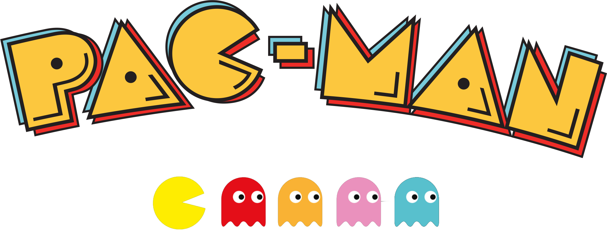

<!-- markdownlint-disable-next-line-->

<h1 align="center">PacMan</h1>

**PacMan** es una representación moderna del clásico videojuego de *arcade*. Consiste en una nueva versión de escritorio de la aventura de nuestro viejo amigo amarillo y sus no tan amigos coloridos. Cuenta con novedosas funcionalidades y accesorios.  

<h2>¿Quiénes somos? </h2>

Este proyecto se encuentra integrado por el siguiente equipo de trabajo:

 - Martina Belén Coria
 - Diego Agustín Savoia
 - Celina Burunov Guerrero  

<h2>Nuestra motivación </h2>

Siendo todos los integrantes del equipo alumnos de 6° año de Programación en la escuela secundaria EPET N°12, decidimos recrear el famoso juego PacMan como parte de un proyecto integrador para el Laboratorio de Construcción de Software, materia que todos cursamos en común. Nuestro objetivo colectivo es poder finalizar este juego antes del fin del ciclo lectivo.  

<h2> Entornos, herramientas y lenguajes </h2>

Para llevar a cabo el proyecto estaremos utilizando distintos lenguajes tales como JavaScript, TypeScript, HTML y CSS. En cuanto a los entornos, nos encontraremos utilizando Visual Studio Code para programar, React para desarrollar la aplicación con herramientas web y Electron para compilar la aplicación creada en React como nativa e incorporar funcionalidades nativas de escritorio.

Contaremos además con algunos programas y herramientas adicionales tales como NodeJS, MongoDB, GitHub, StackEdit, Coolors, Tile Set, entre otros.  

<h2> Estructura del proyecto </h2>

 - **public**
	- **img** 
			  Contiene imágenes   
	- **music**
			   Contiene archivos de audio 
 
 - **components**
    Componentes reutilizables para los distintos archivos TypeScript  
- **game**
    Contiene todos los archivos de TypeScript relacionados al juego 
 - **models**
    Carpetad estinada a todos los modelos del juego 

 - **data-base**

    Contenido relacionado a la base de datos  

<h2>Tareas realizadas </h2>

El siguiente es el listado de las tareas ya realizadas, junto al miembro del equipo que se ha encargado de hacerlas.

:heavy_check_mark: HTML para Top Bar - ***Martina Belén Coria***  
:heavy_check_mark: CSS para Top Bar - ***Celina Burunov Guerrero***  
:heavy_check_mark: Funcionalidad de botones “Minimizar”, “Maximizar/Restaurar” y “Cerrar” de la Top Bar - ***Diego Agustín Savoia***  
:heavy_check_mark: HTML y CSS para Inicio de Sesión - ***Celina Burunov Guerrero***  
:heavy_check_mark: Funcionalidad de “ojo” para mostrar/ocultar contraseña - ***Celina Burunov Guerrero***  
:heavy_check_mark: HTML y CSS de Menú Principal - ***Martina Belén Coria***  
:heavy_check_mark: Menú de Puntajes - ***Diego Agustín Savoia***  
:heavy_check_mark: Funcionalidad para actualizar Lista de Nombre y Puntaje de Jugadores - ***Diego Agustín Savoia***  
:heavy_check_mark: HTML y CSS del Menú de Skins - ***Diego Agustín Savoia***  
:heavy_check_mark: Botones auxiliares funcionales tales como “Back” o “Exit” - ***Martina Belén Coria***  
:heavy_check_mark: Conceptos de tablas para futura base de datos y relación entre estas - ***Celina Burunov Guerrero*** 
:heavy_check_mark: Función de navegación entre pantallas - ***Diego Agustín Savoia***  
:heavy_check_mark: Creación de íconos para Top Bar - ***Celina Burunov***  
:heavy_check_mark: Música temática de fondo - ***Martina Belén Coria***  
:heavy_check_mark: HTML y CSS para Registro - ***Celina Burunov Guerrero***  
:heavy_check_mark: Hardcode de Login - ***Celina Burunov Guerrero***  
:heavy_check_mark: Tile Set del juego - ***Celina Burunov Guerrero***  

<h2>Tareas a realizar </h2>

:heavy_check_mark: Creación de base de datos - ***Diego Agustín Savoia*** 
:heavy_check_mark:  Mapa del juego - ***Diego Agustín Savoia*** 
:heavy_check_mark:  Movimiento pacman - ***Diego Agustín Savoia*** 
:heavy_check_mark:  Animaciones del pacman - ***Diego Agustín Savoia*** 
:heavy_check_mark:  Movimiento fantasmas - ***Celina Burunov*** 
:heavy_check_mark: Modelos de Jugador - ***Celina Burunov***
:heavy_check_mark:  Modelos de Enemigos   - ***Celina Burunov***
:heavy_check_mark:  Tile set (pacman, fantasmas,tablero,frutas,superfrutas) - ***Celina Burunov***  
:grey_question: Sistema de Colisiones  
:grey_question: Funcionalidad de Contador  
:heavy_check_mark:  Login con base de datos - ***Celina Burunov***  
:heavy_check_mark:  Conexión a base de datos - ***Diego Agustín Savoia*** 
:heavy_check_mark:  Medidor de Puntajes Más Altos - ***Diego Agustín Savoia*** 
:heavy_check_mark: Envío de datos desde la app a la base de datos - ***Celina Burunov***  
:heavy_check_mark:Movimiento de menú con flechas - ***Celina Burunov***  
:grey_question: Creación de Aspectos Personalizados para Pacman  
:grey_question: Creación de Mapas Personalizados  
:grey_question: Menú para explorar Aspectos creados por otros jugadores  
<!-- markdownlint-disable-next-line-->